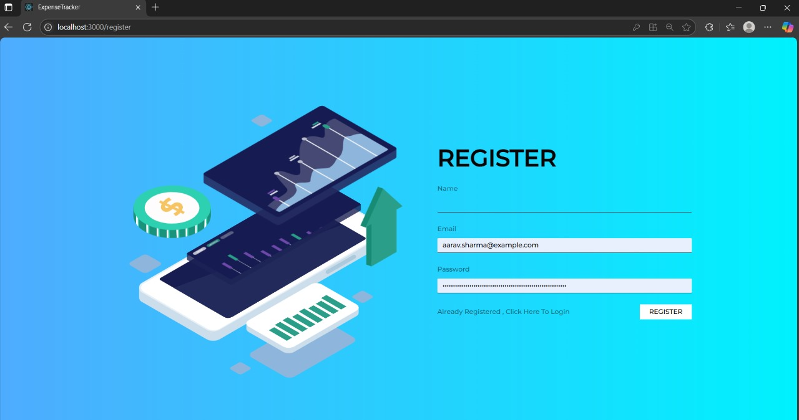
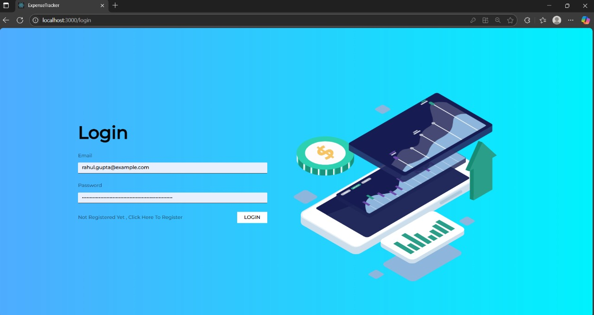

# 💸 Expense Tracker App

A full-stack MERN (MongoDB, Express, React, Node.js) application to manage and analyze personal expenses and income. Built with a focus on clean UI, authentication, and analytics.

### 🚀 Live Demo
[https://expense-tracker-osce.onrender.com/](https://expense-tracker-osce.onrender.com/)

## 📸 Screenshots
### 📝 Register Page

### 🔐 Login

### ✅ Login Successful

### 🏠 Home Page

### 📊 Analytics Page

### ➕ Add New Transaction

---

## ✨ Features

- 🔐 User Authentication (Register/Login)
- 📊 Income vs Expense Analytics
- 📅 Filter by date and category
- 💼 Category-wise breakdown
- ➕ Add / Edit / Delete transactions

---

## 🚀 Tech Stack

**Frontend:**
- React.js
- Axios
- Bootstrap

**Backend:**
- Node.js
- Express.js
- MongoDB (Mongoose)

---
## 🔧 Setup Instructions

1. Clone the repository

   bash
   git clone https://github.com/GarimaGupta40/Expense-Tracker.git
   cd Expense-Tracker

2. Setup the backend
   cd server
   npm install
   node server.js
   ⚠️ Make sure MongoDB is running locally or provide your MongoDB Atlas URI in dbConnect.js.

3. Setup the frontend
   cd client
   npm install
   npm start

   👩‍💻 Author
   
   Garima Gupta
   
   🔗 www.linkedin.com/in/garima-gupta-918052250
   
   📧 garimagupta112003@gmail.com

   

